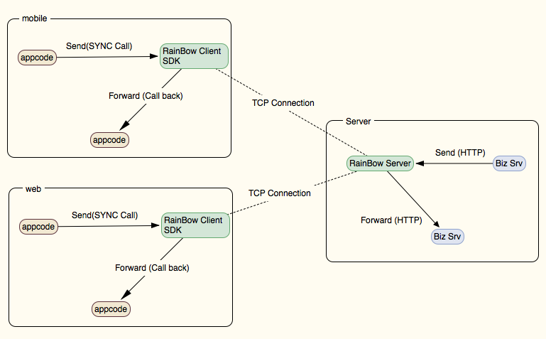

RainBow是一个基于websocket的支持多种QOS的消息转发服务器及客户端SDK。使用RainBow可以让您业务逻辑与链接管理完美的分离开来，且可以继续使用您最熟悉的方式(HTTP)来接入业务逻辑。以下是概览图，绿色部份为RainBow的组成部份:

RainBow的特性
====

- 负责长链接的维护：Rainbow与客户端的SDK将会自动维护长连接，管理打开、关闭、心跳等，无需开发者过多关心链接的细节。

- 链接、业务逻辑分离：RainBow让开发者专注于业务逻辑开发，随时重启业务服务器而不会对已链接的客户端造成影响。

- 消息转发：客户端通过阻塞的方式（SDK提供的方法）发送消息至Rainbow，Rainbow转发消息至业务服务器（通过http请求）。
业务服务器通过请求Rainbow的Http接口发送消息给客户端，Rainbow客户端SDK通过回调的方式传递消息给客户端处理。

- QOS：通过多种QOS（参考MQTT的QOS）来保证客户端及服务器端的消息送达。

消息的定义
===
消息由消息类型及消息参数体两部份组成。

- 消息类型，整型，代表该消息是什么，例如是一条聊天消息，还是状态消息之类的。

- 消息参数体，是json格式的消息。

RainBow的使用
====

RainBow服务器
----

### 安装

 	pip install rainbow-server

### 配置
修改/etc/rainbow/server.ini

	[main]
	# 连接验证接口, 用于对连接上来的客户端进行鉴权，失败者不能建立连接
	connect_url = http://localhost:8000/connect/
	
	# 与客户端连接的websocket端口，默认为1984
	socket_port = 1984  
	
	# 被业务逻辑服务器调用的http端口，默认为2501
	http_port = 2501  
	
	# 用于与业务逻辑服务器相互调用时签名的token
	security_key = xxxxxxx 
	
	# 客户端上行的消息，转发至业务服务器的入口地址模板，需要提供{{message_type}}占位参数。
	# RainBow会将上行的消息类型填充至该模板，并以POST JSON的方式将消息参数传递过去。
	# 上行时 url将会是 http://localhost:8000/chat/{message_type}/
	forward_url = http://localhost:8000/chat/

	# 客户端关闭连接的通知接口
	close_url = http://localhost:8000/close/

### 运行
	./rainbow-server -f /etc/rainbow/server.ini
	
业务服务器
---

业务服务器会主动调用Rainbow的接口，它的接口也会被Rainbow调用。接口调用的鉴权使用同样的逻辑。鉴权逻辑将稍后作详尽说明。

#### 接口

	自定义header参数
	RAINBOW_CLIENT_CHANNEL, rainbow收到这个，表示给当前的websocket handler添加 channel
	RAINBOW_CLIENT_COOKIE, rainbow存放业务调用方的状态信息, 状态信息需要base64后再发到rainbow
	RAINBOW_CLIENT_IDENTITY, 为一个客户端连接到rainbow的唯一标识

业务服务器需要实现以下接口。

### 连接验证接口
	Rainbow会将客户端上行的websocket upgrade的Http请求的信息转发至该接口，接口判断所带上来的Header，参数等是否合法，如果合法则返回一个json，包含标识客户端的唯一标识，可以是用户id或设备id等
	方法 get
	返回值:
		channel可选

		{'status': 'success'}
	
	不合法则返回错误状态：

		{'status': 'fail'}

	此接口需要作为Rainbow的 connect_url 配置。

### 客户端关闭回调接口
	方法 get 

	此接口需要作为Rainbow的 close_url 配置。

### 消息回调接口

客户端每上行一条消息，Rainbow都会转发至该接口，消息的类型会通过URL传递过来，消息体参数则会通过Json的方式POST过来。

该接口的URL请预留部份给Rainbow传递消息类型。 如 http://localhost:8000/chat/message_type/ message_type为0至65535的数字

此接口需要作为RainBow的forward_url配置

#### Rainbow的接口

### 调用Rainbow接口发送消息
	
使用Rainbow的服务端 SDK或直接调用http请求均可。rainbow只暴露一个消息接口：

	/send/?msgtype=xxx&channel=yyyy&qos=1&timeout=5

	方法: POST

	参数: 
	- msgtype, 消息类型
	- channel, 接收消息的客户端channel
	- qos, 通讯质量
	- timeout, 超时
	post body: JSON数据。
	
	返回：
	- {'status': 0, 'connections': 5}
	- 当qos==0时，不带 connections
	- 当qos>=1时，connections 表示成功接收到消息的客户端数量

### 订阅接口, 为客户端订阅某个channel
	/sub/
	方法 post
	body, json {'identity': 'xxx', 'channel': 'xxx'}

### 取消订阅接口, 为客户端取消订阅某个channel
	/unsub/
	方法 post
	body, json {'identity': 'xxx', 'channel': 'xxx'}

客户端
---

以Objective-C为例。

### 安装sdk

推荐使用cocoapods，直接在依赖文件Pod加入：

	rainbow
	
然后在工程目录下执行pod的更新即可完成安装：

	pod update
	
### 使用

#### 创建链接，实现回调Delegate
	
	#include <rainbow/Rainbow.h>
	
	@class MessengerViewController:UIViewController<RainbowDelegate>
	
	......
	// 两个delegate方法：
	
	void rainbow:(Rainbow *)rainbow didClose:(){
		// rainbow已退散。
	}
	
	id rainbow:(Rainbow *rainbow) getMessage:(MESSAGE)message withData:(id)data{
		// 收到来自服务端的消息。该函数返回的数据将会发送到服务器。
	}
	
	Rainbow *rainbow = [RainBow rainbowWithHost:"http://somehost.com" port:1984 security_key='xxxxxxxx'];
	rainbow.delegate = self;
	[rainbow bloom];  // 绽放
	
	.......
	[rainbow fade];   // 退散
	
#### 发送消息
	
	[rainbow send:MESSAGE_CHAT withData:{@"message": @"hello world"} qos:2 
		success:^{} 
		fail: ^{}]
 